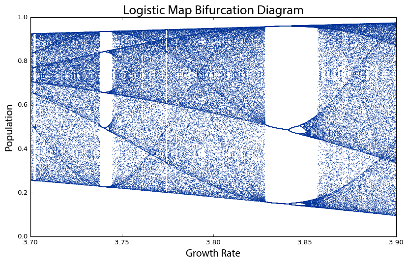

# Summary

Pynamical is a Python package for modeling, simulating, and visualizing discrete nonlinear dynamical systems and chaos. Pynamical facilitates defining discrete one-dimensional nonlinear models as Python functions with just-in-time compilation for fast simulation. It comes packaged with the logistic map, the Singer map, and the cubic map predefined. The models may be run with a range of parameter values over a set of time steps, and the resulting numerical output is returned as a pandas DataFrame. Pynamical can then visualize this output in various ways, including with bifurcation diagrams (May 1976), two-dimensional phase diagrams (Packard et al. 1980), three-dimensional phase diagrams, and cobweb plots (Hofstadter 1985). These visualizations enable simple qualitative assessments of system behavior including phase transitions (Feigenbaum 1983), bifurcation points (Sander and Yorke 2015), attractors and limit cycles (Grebogi et al. 1987), basins of attraction (Sprott and Xiong 2015), and fractals (Mandelbrot 1967; 1983).

Although most real-world systems are nonlinear dynamical systems, their mathematical analysis is notoriously difficult because they cannot be simply broken down into individual parts then recombined linearly (Strogatz 2014). Instead, researchers have long relied on visualization techniques to make system behavior comprehensible (Alpigini 2004; Layek 2015). Such visualization is useful for exploring nonlinear time series data (Bradley and Kantz 2015; Boeing 2016). Pynamical facilitates the modeling, visualization, and exploration of this rich nonlinear behavior, as demonstrated in Figures 1 and 2. Accordingly this package has various applications in research, engineering, and pedagogy. For instance, it allows researchers to model any well-defined discrete nonlinear dynamical system (with just one line of code) and then simulate its behavior over *n* generations in time (with just one more line of code). This facilitates easy experimentation in parameter space and sensitivity analysis. Moreover, Pynamical easily produces publication-quality visualizations to illustrate research findings without having to reinvent the wheel with ad hoc algorithms to produce, reshape, and plot simulation data. Finally, it enables the animation of such systems, to research and present their qualitative behavior and evolution.

Pynamical fills a current gap: the existing software landscape typically requires that such tools either a) be developed ad hoc from scratch or b) exist as add-ons to expensive closed-source commercial packages like MATLAB (Tomida 2008). Pynamical addresses the need for a fast, simple, extensible, free, and open-source Python package for the analysis of such systems in natural and social science research. It depends on the pandas, numpy, numba, and matplotlib Python packages for fast simulation and attractive visualizations to explore system behavior.

The latest stable release of the software can be installed via `pip` and full documentation can be found at https://pynamical.readthedocs.io.

*Figure 1. Bifurcation diagram of the logistic map's chaotic regime.*

*Figure 2. Phase diagram of the logistic map's chaotic regime.*

# References
